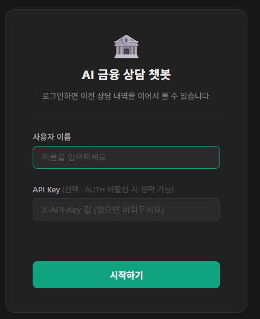

# CLAUDE.md

## 프로젝트 개요

Docker Compose 기반 멀티에이전트 AI 서비스 MVP.
PostgreSQL 기반 경량 업무 지식 모델을 중심으로 Leader Agent 라우팅, Tool/API Hub, Trace/Evidence 저장을 구현한다.

**핵심 원칙**: 정식 온톨로지/Graph DB/RDF/OWL/SPARQL은 이 단계에서 구현하지 않는다.

---

## 기술 스택

| 영역 | 기술 |
|---|---|
| Language | Python 3.11 |
| Framework | FastAPI |
| ORM | SQLAlchemy 2.x |
| Migration | Alembic |
| DB | PostgreSQL 15 |
| Cache | Redis 7 |
| Validation | Pydantic v2 |
| HTTP Client | httpx |
| Test | pytest |
| Container | Docker / Docker Compose |

---

## 디렉터리 구조

```text
c:/temp/core-banking/
 ├ docker-compose.yml
 ├ .env.example
 ├ docs/
 │  ├ chat-flow.md         # 채팅 요청 10단계 파이프라인 설명
 │  └ AGENTS.md            # Agent 아키텍처 상세 문서 ← 새 파일
 ├ backend/
 │  ├ Dockerfile
 │  ├ requirements.txt
 │  ├ alembic.ini
 │  ├ alembic/
 │  ├ tests/
 │  │  ├ conftest.py          # pytest fixture (db, client)
 │  │  ├ test_health.py
 │  │  ├ test_knowledge.py
 │  │  ├ test_agent.py
 │  │  ├ test_tool.py
 │  │  ├ test_evidence_scorer.py
 │  │  ├ test_chat.py         # Chat API 통합 + 의도별 테스트
 │  │  └ test_auth.py         # 인증/권한 테스트 (AUTH_ENABLED=True 시뮬레이션)
 │  └ app/
 │     ├ main.py
 │     ├ core/            # config, database, security
 │     ├ api/routes/      # ai_gateway, agent, knowledge, tool, trace 라우터
 │     ├ agents/
 │     │  ├ base_agent.py  # AbstractAgent + AgentInput/AgentOutput (기본 run() 포함)
 │     │  ├ leader.py      # LeaderAgent — 10단계 파이프라인
 │     │  ├ agent_registry.py  # route_by_concepts() — DB 기반 라우팅
 │     │  ├ memory.py      # Redis Short Memory (load_history / save_turn)
 │     │  ├ product_agent.py   # 상품/신청조건 (base run() 그대로 사용)
 │     │  ├ rate_agent.py      # 금리/시뮬레이션 (COMPARISON 메타데이터 추가)
 │     │  ├ policy_agent.py    # 정책/약관 (APPLICATION 메타데이터 추가)
 │     │  └ search_agent.py    # 서류검색/상담이력 (키워드 파라미터 커스텀)
 │     ├ orchestrator/
 │     │  ├ executor.py    # LeaderAgent fallback 경로 (미등록 Agent용)
 │     │  ├ planner.py     # [DEPRECATED] leader.py로 대체됨
 │     │  └ aggregator.py  # [DEPRECATED] leader.py._summarize()로 대체됨
 │     ├ knowledge/        # concept_service (Redis 캐시 포함)
 │     ├ tools/            # tool_gateway (invoke_tool)
 │     ├ trace/            # trace_service, evidence_service, evidence_scorer
 │     ├ models/           # knowledge_model, agent_model, trace_model
 │     ├ schemas/          # ai_gateway, knowledge, agent, tool schemas
 │     └ seed/             # concepts_seed, agents_seed, tools_seed, mappings_seed, relations_seed
 └ mock-api/
    ├ Dockerfile
    └ main.py              # v0.2.0 — 8개 엔드포인트, 전체 Query 파라미터 optional
```

---

## 개발 금지 범위

아래는 이 MVP에서 절대 구현하지 않는다.

- Neo4j / Graph DB
- RDF / OWL / SPARQL
- 자동 온톨로지 생성 / 자동 관계 추론
- 전사 용어 표준화 / 모든 DB 컬럼 매핑
- 실제 코어뱅킹 실거래 API 연계
- Kubernetes 운영 배포
- 운영용 보안 인증 체계 완성
# 장기 메모리 기반 개인정보 저장

---

## 핵심 설계 원칙

1. Agent는 API를 직접 호출하지 않는다 — 반드시 Tool/API Hub를 통한다.
2. Agent 라우팅은 `concept_id`와 `agent_concept_mapping` 테이블 기반이다 — LLM 임의 판단 금지.
3. Tool/API 선택은 `concept_api_mapping` 테이블 기반이다.
4. 모든 요청은 `trace_event`에 저장한다.
5. 중요 응답은 `evidence_reference`에 저장한다.
6. Mock API로 먼저 검증하고, 실제 API 연계는 후속 단계에서 분리한다.

---

## 개발 Phase 순서

| Phase | 내용 | 완료 조건 |
|---|---|---|
| 0 | Docker 기본 구조 | `docker compose up` 후 `/health` 정상 응답 |
| 1 | DB 모델 + Alembic | `alembic upgrade head` 후 전체 테이블 생성 |
| 2 | Seed 데이터 | `python -m app.seed.run_seed` 정상 실행 |
| 3 | Knowledge Metadata Service | keyword 기반 concept 검색 동작 |
| 4 | Agent Registry + Agent Router | concept_id 기준 Agent 목록 반환 |
| 5 | Tool/API Hub + Mock API | Mock 상품/금리/규정 데이터 조회 |
| 6 | Leader Agent / Orchestrator | 실행 계획 JSON 생성 |
| 7 | Trace/Evidence 저장 | 요청 1건당 trace 3건 이상, evidence 1건 이상 |
| 8 | AI Gateway Chat API | Swagger에서 Chat API 정상 응답 |
| 9 | 통합 테스트 | `pytest` 전체 통과 |
| 10 | 문서화 | README/가이드 작성 |

---

## 실행 명령

```bash
# 전체 서비스 시작
docker compose up -d --build

# 마이그레이션
docker compose exec backend alembic upgrade head

# Seed 데이터 등록
docker compose exec backend python -m app.seed.run_seed

# 테스트
docker compose exec backend pytest

# 헬스 체크 (호스트에서 접근 시 외부 포트 사용)
curl http://localhost:18000/health
curl http://localhost:18010/health
```

---

## 주요 API 엔드포인트

```http
POST /api/v1/ai/chat
GET  /api/v1/ai/traces/{request_id}
GET  /api/v1/ai/traces/{request_id}/events
GET  /api/v1/ai/traces/{request_id}/evidence

GET  /api/v1/knowledge/concepts
GET  /api/v1/knowledge/concepts/search?keyword=금리
GET  /api/v1/knowledge/concepts/{concept_id}/agents
GET  /api/v1/knowledge/concepts/{concept_id}/apis

GET  /api/v1/tools
POST /api/v1/tools/invoke
```

---

## DB 테이블 목록

경량 업무 지식 모델:
- `business_concept`
- `business_term_alias`
- `business_concept_relation`
- `data_source_catalog`
- `api_catalog`
- `concept_data_mapping`
- `concept_api_mapping`
- `agent_catalog`
- `agent_concept_mapping`

Trace/Evidence/감사:
- `trace_event`
- `evidence_reference`
- `leader_decision`   ← Leader Agent 라우팅 판단 감사 로그 (AI 설명 가능성 용도)

---

## Seed 데이터 범위

Concept: `CONCEPT_CUSTOMER`, `CONCEPT_LOAN_PRODUCT`, `CONCEPT_PERSONAL_CREDIT_LOAN`, `CONCEPT_INTEREST_RATE`, `CONCEPT_PREFERENTIAL_RATE`, `CONCEPT_REQUIRED_DOCUMENT`, `CONCEPT_POLICY`, `CONCEPT_TERMS`, `CONCEPT_COUNSELING_HISTORY`, `CONCEPT_APPLICATION_CONDITION`

Agent: `LEADER_AGENT`, `PRODUCT_AGENT`, `RATE_AGENT`, `POLICY_AGENT`, `SEARCH_AGENT`

Tool: `MOCK_PRODUCT_LOOKUP`, `MOCK_RATE_LOOKUP`, `MOCK_POLICY_LOOKUP`, `MOCK_DOCUMENT_SEARCH`

---

## 포트 매핑

| 서비스 | 컨테이너 내부 | 호스트(외부) | 용도 |
|---|---|---|---|
| backend (FastAPI) | 8000 | **18000** | API + Chat UI (`http://localhost:18000/`) |
| mock-api | 8010 | **18010** | Mock 상품/금리/서류 API |
| PostgreSQL | 5432 | **5433** | DB 직접 접근 (DBeaver 등) |
| Redis | 6379 | **6379** | Short Memory + Concept 검색 캐시 |
| pgAdmin | 80 | **5050** | DB 관리 UI (`http://localhost:5050/`) |

> 컨테이너 간 통신은 내부 포트 사용 (예: `MOCK_API_URL=http://mock-api:8010`).  
> 호스트 브라우저·curl에서는 외부 포트 사용.

---

## AI / LLM 통합

- **LLM**: OpenAI GPT-4o 사용 (`openai` 패키지, `AsyncOpenAI` 클라이언트)
- **API 키 설정**: `.env` 파일에 `OPENAI_API_KEY=sk-...` 설정 필요
- **키 없을 때 동작(fallback)**: LLM 기능 비활성화, 템플릿 기반 한국어 답변 자동 반환 — 서비스 중단 없음
- **의도 분석**: `temperature=0.0`, `response_format=json_object` — 결정적 JSON 응답
- **최종 요약**: `temperature=0.3`, `max_tokens=1024` — 의도별 스타일 지침 포함

---

## 인증 (Auth)

- 기본값 `AUTH_ENABLED=False` → 개발 환경에서 인증 없이 전체 허용 (ADMIN 권한으로 처리)
- 헤더: `X-API-Key: {key}` (Swagger UI에서 자동으로 입력창 표시됨)
- 역할: `ADMIN` > `ANALYST` > `READONLY`
- Chat API(`/api/v1/ai/chat`)는 `ANALYST` 이상 필요

---

## Short Memory (Redis)

- 키: `session:{session_id}:history`
- 최대 5턴(10 메시지) 보관, TTL 1시간
- Redis 장애 시 메모리 없이 서비스 계속 동작 (graceful degradation)
- `session_id` 미전달 시 매 요청이 독립적으로 처리됨

---

## 현재 구현 상태 (Phase 완료 기준)

| Phase | 내용 | 상태 |
|---|---|---|
| 0 | Docker 기본 구조 | 완료 |
| 1 | DB 모델 + Alembic | 완료 — `knowledge_model`, `agent_model`, `trace_model` |
| 2 | Seed 데이터 | 완료 — `run_seed.py` (concepts/agents/tools/mappings/relations) |
| 3 | Knowledge Metadata Service | 완료 — `concept_service.py` (Redis 캐시 포함) |
| 4 | Agent Registry + Router | 완료 — `agent_registry.py`, `base_agent.py` |
| 5 | Tool/API Hub + Mock API | 완료 — `tool_gateway.py`, `mock-api/main.py` v0.2.0 |
| 6 | Leader Agent / Orchestrator | 완료 — `leader.py` (10단계 파이프라인), Sub-Agent 4종 |
| 7 | Trace/Evidence 저장 | 완료 — `trace_service.py`, `evidence_service.py`, `evidence_scorer.py` |
| 8 | AI Gateway Chat API | 완료 — `POST /api/v1/ai/chat`, Chat UI (`/`) |
| 9 | 통합 테스트 | 진행 중 — `test_chat.py`(7케이스), `test_auth.py`(10케이스) 작성 완료. `pytest` 실행 검증 필요 |
| 10 | 문서화 | 진행 중 — `docs/chat-flow.md`, `docs/AGENTS.md` 작성됨 |

---

## 환경 변수

`.env.example` 참고. 비밀값은 환경변수로 관리하며 코드에 하드코딩하지 않는다.

```env
POSTGRES_DB=ai_agent_db
POSTGRES_USER=ai_agent
POSTGRES_PASSWORD=ai_agent_password
REDIS_URL=redis://redis:6379
MOCK_API_URL=http://mock-api:8010
OPENAI_API_KEY=sk-...        # GPT-4o 사용 시 필수. 없으면 템플릿 fallback 동작
AUTH_ENABLED=false            # 개발 환경 기본값. true 설정 시 X-API-Key 헤더 필수
API_KEY_ADMIN=...
API_KEY_ANALYST=...
API_KEY_READONLY=...
```

---

## Long Memory — 새 대화 세션 복원용 핵심 컨텍스트

> 이 섹션은 Claude Code가 새 대화를 시작할 때 프로젝트 맥락을 빠르게 복원하기 위한 요약이다.

### 핵심 설계 결정 (변경 시 반드시 여기도 갱신)

1. **Agent는 API 직접 호출 금지** — `tool_gateway.invoke_tool()` 경유 필수. 새 API 추가 시 `api_catalog` 테이블에만 등록하면 코드 변경 불필요.
2. **라우팅은 DB 매핑** — `agent_concept_mapping` 테이블 기반. LLM이 Agent를 고르지 않는다.
3. **Neo4j/Graph DB/RDF/OWL 없음** — PostgreSQL `business_concept_relation` 테이블로 온톨로지 관계를 대체한다.
4. **Evidence 신뢰도 = 데이터 품질(50%) + 의도 관련도(40%) + 응답 속도 보너스(10%)** (`evidence_scorer.py`)
5. **Concept 검색 결과는 Redis 5분 캐시** — `concept:search:{keyword}` 키. 장애 시 DB 직접 조회 fallback.

### 파일 탐색 시작점

| 작업 | 시작 파일 |
|---|---|
| 채팅 API 흐름 수정 | `backend/app/api/routes/ai_gateway.py` |
| 의도 분석 / 라우팅 로직 | `backend/app/agents/leader.py` |
| 새 Sub-Agent 추가 | `backend/app/agents/base_agent.py` → 구현체 작성 → `leader.py` `_AGENT_REGISTRY` 등록 → [AGENTS.md](docs/AGENTS.md) 참고 |
| 새 Mock API 추가 | `mock-api/main.py` → `api_catalog` seed → `concept_api_mapping` seed |
| Trace/Evidence 기록 | `backend/app/trace/trace_service.py`, `evidence_service.py` |
| DB 스키마 변경 | `backend/app/models/` → `alembic revision --autogenerate` → `alembic upgrade head` |
| Seed 데이터 변경 | `backend/app/seed/` → `docker compose exec backend python -m app.seed.run_seed` |
| 인증 설정 변경 | `backend/app/core/security.py` (역할 체계), `backend/app/core/config.py` (AUTH_ENABLED) |
| 테스트 추가/수정 | `backend/tests/` — `conftest.py` fixture 공유, `test_chat.py` / `test_auth.py` 참고 |
| Evidence 점수 기준 변경 | `backend/app/trace/evidence_scorer.py` (_REQUIRED_FIELDS, _INTENT_RELEVANCE_TABLE) |

### 알려진 주의사항

- `leader_decision` 테이블은 Alembic 마이그레이션에 포함돼야 한다. 누락 시 Leader Agent 실행 중 DB 오류 발생.
- `short memory` TTL은 1시간. 세션 간 대화 연속성은 이 TTL 내에서만 보장.
- `docker compose exec backend pytest` 실행 전 마이그레이션과 seed가 완료돼 있어야 한다.
- 호스트에서 접근할 때는 반드시 외부 포트(18000, 18010) 사용. 컨테이너 내부 포트(8000, 8010)는 호스트에서 직접 접근 불가.
- `orchestrator/planner.py`와 `orchestrator/aggregator.py`는 deprecated. 실제 처리는 `leader.py`에서 수행.
- `test_auth.py`는 `monkeypatch`로 `settings.AUTH_ENABLED=True`를 임시 설정하므로 `.env`의 AUTH_ENABLED 값과 무관하게 동작한다.
- Sub-Agent는 `AbstractAgent`를 상속하며, 기본 `run()`은 `params={}`로 전체 데이터를 조회한다. 특수 파라미터가 필요한 경우에만 오버라이드한다. 자세한 내용은 [AGENTS.md](docs/AGENTS.md) 참고.
- Mock API v0.2.0에서 `simulate_repayment`, `check_eligibility`, `get_counseling_history` 모든 Query 파라미터가 optional로 변경됨 (기본값: 3천만원/36개월/5%). 이 3개 엔드포인트는 `params={}` 호출 시 정상 응답한다.
