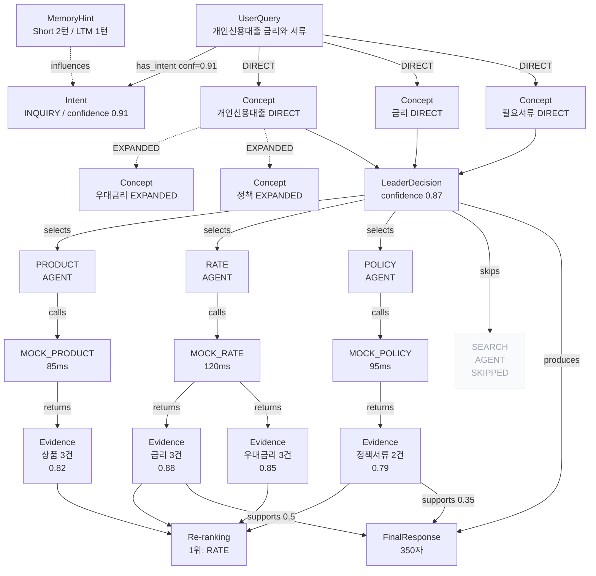

# Decision Graph 상세설계서

> 작성일: 2026-06-12  
> 대상 시스템: Core Banking AI Agent (FastAPI + PostgreSQL + Redis + GPT-4o)  
> 설계 범위: Leader Agent Decision Graph — MVP Phase 1~3

---

## 1. 설계 목적

**Leader Agent가 사용자 질문 1건을 처리하는 전체 판단 과정을 그래프로 기록하고 검토한다.**

| 목적 | 설명 |
|---|---|
| 판단 추적 | 의도 분류 → Concept 탐지 → Agent 선택 → Tool 호출 → Evidence 수집 → 답변 생성까지 전 과정 |
| 감사 로그 | 왜 특정 Agent를 선택했는지, 어떤 근거로 답변했는지 사후 검토 가능 |
| 품질 평가 | 잘못된 Agent 선택, 누락된 Concept, 부족한 Evidence를 사람이 직접 확인 |
| 확장성 | 온톨로지 연동, Graph RAG, 자동 평가로 확장 가능한 구조 |

### 핵심 질문

```text
사용자 질문이 들어왔을 때,
Leader Agent는 무슨 의도로 해석했고,
어떤 Concept을 탐지했고,
왜 특정 Agent를 선택했고,
어떤 Tool/API를 호출했고,
어떤 Evidence를 사용했고,
어떤 점수로 우선순위를 정했고,
어떤 이유로 최종 답변을 생성했는가?
```

---

## 2. 전체 개념

### 2-1. Decision Graph란

특정 요청(request_id) 1건에 대한 **Leader Agent의 판단 과정 그래프**.  
노드(Node)는 판단 단계의 엔티티, 엣지(Edge)는 판단 흐름의 관계다.

```
UserQuery
  │ has_intent
  ▼
Intent ←── influences ── MemoryHint
  │
  │ detects
  ▼
Concept (N개)
  │ handled_by
  ▼
LeaderDecision ──── selects ──→ SubAgent (N개)
                                    │ calls
                                    ▼
                                  Tool (N개)
                                    │ returns
                                    ▼
                                Evidence (N개)
                                    │ supports
                                    ▼
                              FinalResponse
                                    │ reviewed_by
                                    ▼
                                ReviewResult
```

### 2-2. 데이터 흐름 요약

```
[채팅 요청 수신]
  └─ request_id 생성
  └─ UserQuery 노드 생성

[Leader Agent 실행]
  └─ MemoryHint 노드 생성 (Short + LTM)
  └─ Intent 노드 생성
  └─ Concept 노드 N개 생성
  └─ LeaderDecision 노드 생성
  └─ SubAgent 노드 N개 생성 (선택된 것만)
  └─ Tool 노드 + ToolCall 노드 N개 생성
  └─ Evidence 노드 N개 생성
  └─ ReRankingScore 노드 생성
  └─ FinalResponse 노드 생성

[엣지 생성]
  └─ 위 노드들 간 관계 엣지 저장
```

---

## 3. Decision Graph와 Ontology Graph 구분

### 3-1. 핵심 차이

| 구분 | Decision Graph | Ontology Graph |
|---|---|---|
| 기준 | request_id (요청 1건) | concept_id (업무 개념) |
| 목적 | 특정 판단 과정 추적 | 업무 지식 구조화 |
| 변경 빈도 | 요청마다 생성 | 비교적 안정적 |
| 저장 기간 | 90일 (설정 가능) | 영구 |
| 노드 종류 | UserQuery, Intent, ToolCall, Evidence... | Concept, ConceptRelation, Domain... |
| 조회 목적 | 감사 추적, 품질 평가 | Agent 라우팅, 관계 추론 |

### 3-2. MVP에서의 관계

```text
Decision Graph의 Concept 노드 → ontology의 concept_id를 외래 참조
Decision Graph 저장 시 concept_id만 복사 (concept 이름/도메인은 런타임에 조인)
concept_relation은 MVP에서 라우팅 품질을 위해 이미 존재 → Decision Graph에서는 "확장된 concept"만 기록
```

### 3-3. 각 질문에 대한 답

1. **분리 방법**: `leader_decision_*` 테이블(Decision Graph)과 `business_concept*` 테이블(Ontology) 분리. 공유 키는 `concept_id`만.
2. **concept_id 참조**: 반드시 FK 참조. Concept 노드는 `concept_id`를 가지며 concept 이름은 JOIN으로 가져옴.
3. **MVP에서 concept_relation 필요성**: 이미 존재. Decision Graph에서는 "확장 경로"만 기록하면 충분.
4. **온톨로지 확장 시점**: Phase 4. Phase 1~3은 PostgreSQL 기반으로 충분.
5. **PostgreSQL 한계**: 단일 개념 관계 탐색(1~2홉), 집계, 감사 추적까지는 충분. 복잡한 다홉 관계 탐색(3홉 이상)에서 성능 저하.
6. **Neo4j 도입 시점**: DAU 1,000+ 이상이거나 온톨로지 자동 추론이 필요한 시점. MVP 이후.

---

## 4. 핵심 노드 설계

### Node: UserQuery

| 항목 | 내용 |
|---|---|
| 역할 | 사용자가 입력한 원본 질문 |
| 필수 속성 | `request_id`, `message`, `session_id`, `channel`, `created_at` |
| 선택 속성 | `user_id`, `ip_address` |
| 저장 | Yes — trace_event (REQUEST_RECEIVED) |
| 화면 표시 | Yes — 그래프 최상단 진입점 |
| 예시 | `{"message": "개인신용대출 금리와 필요한 서류 알려줘", "session_id": "user-001"}` |

---

### Node: MemoryHint

| 항목 | 내용 |
|---|---|
| 역할 | Short Memory + Long-term Memory에서 로드된 과거 대화 맥락 |
| 필수 속성 | `memory_type` (SHORT/LTM), `turns_loaded`, `summary` |
| 선택 속성 | `top_keywords`, `past_intents`, `session_age_min` |
| 저장 | Yes — leader_decision_node |
| 화면 표시 | Yes — Intent 노드 좌측에 표시 |
| 예시 | `{"memory_type": "SHORT", "turns_loaded": 2, "summary": "이전에 금리 조회 완료"}` |

---

### Node: Intent

| 항목 | 내용 |
|---|---|
| 역할 | 사용자 질문의 목적 분류 결과 |
| 필수 속성 | `intent_code`, `intent_name`, `confidence`, `keywords`, `urgency` |
| 선택 속성 | `reason`, `raw_llm_output`, `duration_ms` |
| 저장 | Yes — leader_decision_node |
| 화면 표시 | Yes — 의도 유형과 신뢰도 표시 |
| 예시 | `{"intent_code": "INQUIRY", "intent_name": "금리+서류 조회", "confidence": 0.91, "keywords": ["개인신용대출", "금리", "서류"]}` |

---

### Node: Concept

| 항목 | 내용 |
|---|---|
| 역할 | 탐지된 업무 개념 단위 |
| 필수 속성 | `concept_id`, `concept_name`, `domain`, `detection_type` (DIRECT/EXPANDED) |
| 선택 속성 | `source_keyword`, `relation_path`, `weight` |
| 저장 | Yes — leader_decision_node (개당 1행) |
| 화면 표시 | Yes — 탐지/확장 구분 색상 |
| 예시 | `{"concept_id": "CONCEPT_INTEREST_RATE", "concept_name": "금리", "detection_type": "DIRECT", "source_keyword": "금리"}` |

---

### Node: LeaderDecision

| 항목 | 내용 |
|---|---|
| 역할 | Leader Agent의 최종 판단 요약 (라우팅 근거 + 신뢰도) |
| 필수 속성 | `request_id`, `detected_intent`, `all_concept_ids`, `selected_agent_ids`, `confidence_score`, `total_steps` |
| 선택 속성 | `reasoning_json`, `fallback_used`, `ltm_turns` |
| 저장 | Yes — leader_decision 테이블 (기존) |
| 화면 표시 | Yes — 그래프 중앙 허브 노드 |
| 예시 | `{"confidence_score": 0.87, "selected_agent_ids": ["PRODUCT_AGENT", "RATE_AGENT"]}` |

---

### Node: SubAgent

| 항목 | 내용 |
|---|---|
| 역할 | 선택된 Sub-Agent (실행 결과 포함) |
| 필수 속성 | `agent_id`, `agent_name`, `status` (SELECTED/SKIPPED/FAILED), `concept_ids` |
| 선택 속성 | `reason_selected`, `duration_ms`, `tool_count` |
| 저장 | Yes — leader_decision_node |
| 화면 표시 | Yes — SELECTED/SKIPPED/FAILED 색상 구분 |
| 예시 | `{"agent_id": "RATE_AGENT", "status": "SELECTED", "concept_ids": ["CONCEPT_INTEREST_RATE", "CONCEPT_PREFERENTIAL_RATE"]}` |

---

### Node: Tool

| 항목 | 내용 |
|---|---|
| 역할 | 사용 가능한 Tool/API 메타 정보 |
| 필수 속성 | `tool_id`, `tool_name`, `endpoint`, `method` |
| 선택 속성 | `description`, `expected_response_ms` |
| 저장 | No (api_catalog에서 조회) |
| 화면 표시 | ToolCall 노드와 함께 표시 |
| 예시 | `{"tool_id": "MOCK_RATE_LOOKUP", "endpoint": "/rates"}` |

---

### Node: ToolCall

| 항목 | 내용 |
|---|---|
| 역할 | 실제 Tool 호출 1건의 실행 결과 |
| 필수 속성 | `tool_id`, `agent_id`, `status` (SUCCESS/FAILED/TIMEOUT), `duration_ms` |
| 선택 속성 | `request_params`, `response_summary`, `error_code`, `error_message`, `http_status` |
| 저장 | Yes — leader_decision_node (TOOL_INVOKED 이벤트 기반) |
| 화면 표시 | Yes — 성공/실패 색상, duration_ms 표시 |
| 예시 | `{"tool_id": "MOCK_RATE_LOOKUP", "status": "SUCCESS", "duration_ms": 120, "response_summary": "금리 3건 반환"}` |

---

### Node: Evidence

| 항목 | 내용 |
|---|---|
| 역할 | Tool 호출로 수집된 근거 데이터 1건 |
| 필수 속성 | `source_tool_id`, `concept_id`, `confidence_score`, `data_quality_score`, `item_count` |
| 선택 속성 | `raw_data_summary`, `related_evidence_ids`, `intent_relevance_score`, `flags` |
| 저장 | Yes — evidence_reference (기존) + leader_decision_node |
| 화면 표시 | Yes — 점수 시각화, 원문 팝업 |
| 예시 | `{"source_tool_id": "MOCK_RATE_LOOKUP", "confidence_score": 0.88, "item_count": 3}` |

---

### Node: ReRankingScore

| 항목 | 내용 |
|---|---|
| 역할 | Evidence/Tool 결과의 재정렬 점수 |
| 필수 속성 | `source_id`, `data_quality_score`, `intent_relevance_score`, `latency_bonus`, `total_score`, `rank` |
| 선택 속성 | `reason` |
| 저장 | Yes — leader_decision_node |
| 화면 표시 | Yes — 막대 차트 또는 숫자 표시 |
| 예시 | `{"source_id": "MOCK_RATE_LOOKUP", "total_score": 1.38, "rank": 1}` |

---

### Node: FinalResponse

| 항목 | 내용 |
|---|---|
| 역할 | LLM이 생성한 최종 한국어 답변 |
| 필수 속성 | `answer_text`, `answer_length`, `llm_model`, `intent_applied`, `duration_ms` |
| 선택 속성 | `template_fallback`, `evidence_ids_used`, `memory_turns_used` |
| 저장 | Yes — leader_decision_node |
| 화면 표시 | Yes — 답변 전문 + 사용된 Evidence 링크 |
| 예시 | `{"answer_length": 350, "llm_model": "gpt-4o", "intent_applied": "INQUIRY"}` |

---

### Node: TraceEvent

| 항목 | 내용 |
|---|---|
| 역할 | 각 처리 단계의 이벤트 로그 |
| 필수 속성 | `event_type`, `status`, `created_at`, `duration_ms` |
| 선택 속성 | `agent_id`, `tool_id`, `input_data`, `output_data` |
| 저장 | Yes — trace_event (기존) |
| 화면 표시 | Yes — Timeline 뷰 |
| 예시 | `{"event_type": "INTENT_ANALYZED", "status": "success", "duration_ms": 340}` |

---

## 5. 핵심 엣지 설계

### Edge: has_intent

| 항목 | 내용 |
|---|---|
| Source → Target | UserQuery → Intent |
| 의미 | 사용자 질문이 특정 의도로 분류됨 |
| 필수 속성 | `confidence`, `model`, `duration_ms` |
| 점수/가중치 | Yes — confidence (0.0~1.0) |
| 화면 표시 | Yes — 주 흐름선 (굵은 파란선) |
| 예시 | `{"confidence": 0.91, "model": "gpt-4o", "duration_ms": 340}` |

---

### Edge: influences

| 항목 | 내용 |
|---|---|
| Source → Target | MemoryHint → Intent |
| 의미 | 과거 대화 기억이 의도 분류에 영향을 줌 |
| 필수 속성 | `memory_type`, `turns_used` |
| 점수/가중치 | No |
| 화면 표시 | Yes — 점선 (보조 영향선) |
| 예시 | `{"memory_type": "LTM", "turns_used": 2}` |

---

### Edge: detects

| 항목 | 내용 |
|---|---|
| Source → Target | UserQuery → Concept |
| 의미 | 질문에서 특정 업무 개념이 탐지됨 |
| 필수 속성 | `detection_type` (DIRECT/EXPANDED), `source_keyword`, `weight` |
| 점수/가중치 | Yes — weight (0.0~1.0) |
| 화면 표시 | Yes — DIRECT: 실선, EXPANDED: 점선 |
| 예시 | `{"detection_type": "DIRECT", "source_keyword": "금리", "weight": 1.0}` |

---

### Edge: handled_by

| 항목 | 내용 |
|---|---|
| Source → Target | Concept → SubAgent |
| 의미 | 특정 Concept이 특정 Agent가 처리함 |
| 필수 속성 | `mapping_source` (DB), `concept_id`, `agent_id` |
| 점수/가중치 | No |
| 화면 표시 | Yes |
| 예시 | `{"mapping_source": "agent_concept_mapping", "concept_id": "CONCEPT_INTEREST_RATE"}` |

---

### Edge: selects

| 항목 | 내용 |
|---|---|
| Source → Target | LeaderDecision → SubAgent |
| 의미 | Leader가 특정 Agent를 최종 선택함 |
| 필수 속성 | `reason`, `confidence`, `concept_coverage` |
| 점수/가중치 | Yes — concept_coverage (담당 Concept 수) |
| 화면 표시 | Yes — 굵은 선, 이유 툴팁 |
| 예시 | `{"reason": "CONCEPT_INTEREST_RATE 매핑", "concept_coverage": 2}` |

---

### Edge: calls

| 항목 | 내용 |
|---|---|
| Source → Target | SubAgent → ToolCall |
| 의미 | Sub-Agent가 Tool Gateway를 통해 API 호출 |
| 필수 속성 | `tool_id`, `params_summary`, `attempt_count` |
| 점수/가중치 | No |
| 화면 표시 | Yes — 성공: 초록, 실패: 빨간 |
| 예시 | `{"tool_id": "MOCK_RATE_LOOKUP", "attempt_count": 1}` |

---

### Edge: returns

| 항목 | 내용 |
|---|---|
| Source → Target | ToolCall → Evidence |
| 의미 | Tool 호출 결과가 Evidence로 수집됨 |
| 필수 속성 | `item_count`, `data_quality_score` |
| 점수/가중치 | Yes — data_quality_score |
| 화면 표시 | Yes |
| 예시 | `{"item_count": 3, "data_quality_score": 0.8}` |

---

### Edge: scored_by

| 항목 | 내용 |
|---|---|
| Source → Target | Evidence → ReRankingScore |
| 의미 | Evidence가 Re-ranking 점수로 평가됨 |
| 필수 속성 | `total_score`, `rank` |
| 점수/가중치 | Yes — total_score |
| 화면 표시 | Yes — 순위 표시 |
| 예시 | `{"total_score": 1.38, "rank": 1}` |

---

### Edge: supports

| 항목 | 내용 |
|---|---|
| Source → Target | Evidence → FinalResponse |
| 의미 | Evidence가 최종 답변의 근거로 사용됨 |
| 필수 속성 | `contribution_weight`, `used_in_prompt` |
| 점수/가중치 | Yes — contribution_weight |
| 화면 표시 | Yes — 굵기로 기여도 표현 |
| 예시 | `{"contribution_weight": 0.6, "used_in_prompt": true}` |

---

### Edge: uses_evidence

| 항목 | 내용 |
|---|---|
| Source → Target | LeaderDecision → Evidence |
| 의미 | Leader가 특정 Evidence를 판단 근거로 사용 |
| 필수 속성 | `evidence_id`, `usage_type` (PRIMARY/SECONDARY) |
| 점수/가중치 | No |
| 화면 표시 | Yes — 점선 (간접 참조) |

---

### Edge: produces

| 항목 | 내용 |
|---|---|
| Source → Target | LeaderDecision → FinalResponse |
| 의미 | Leader 판단이 최종 답변을 생성함 |
| 필수 속성 | `intent_applied`, `evidence_count_used`, `duration_ms` |
| 점수/가중치 | No |
| 화면 표시 | Yes — 주 출력선 |

---

### Edge: records

| 항목 | 내용 |
|---|---|
| Source → Target | TraceEvent → LeaderDecision |
| 의미 | TraceEvent가 Leader 판단을 기록함 |
| 필수 속성 | `event_type`, `sequence` |
| 점수/가중치 | No |
| 화면 표시 | Yes — Timeline 뷰 전용 |

---

## 6. Graph JSON 스키마

### 6-1. 전체 응답 구조

```json
{
  "request_id": "a1b2c3d4-...",
  "query": "개인신용대출 금리와 필요한 서류 알려줘",
  "created_at": "2026-06-12T10:30:00Z",
  "total_duration_ms": 1840,

  "summary": {
    "intent": "INQUIRY",
    "intent_name": "조회",
    "intent_confidence": 0.91,
    "detected_concepts": ["CONCEPT_PERSONAL_CREDIT_LOAN", "CONCEPT_INTEREST_RATE", "CONCEPT_REQUIRED_DOCUMENT"],
    "expanded_concepts": ["CONCEPT_PREFERENTIAL_RATE", "CONCEPT_POLICY"],
    "selected_agents": ["PRODUCT_AGENT", "RATE_AGENT", "POLICY_AGENT"],
    "skipped_agents": ["SEARCH_AGENT"],
    "tool_call_count": 3,
    "tool_success_count": 3,
    "evidence_count": 4,
    "final_score": 0.87,
    "answer_length": 350
  },

  "nodes": [...],
  "edges": [...],

  "review": {
    "status": "PENDING",
    "reviewer_id": null,
    "comment": null,
    "overall_result": null
  }
}
```

---

### 6-2. Node 구조

```json
{
  "id": "node_intent_a1b2c3",
  "type": "INTENT",
  "label": "의도 분석",
  "status": "SUCCESS",

  "position": {"x": 300, "y": 150},

  "data": {
    "intent_code": "INQUIRY",
    "intent_name": "금리+서류 조회",
    "confidence": 0.91,
    "keywords": ["개인신용대출", "금리", "서류"],
    "urgency": "low",
    "reason": "질문에 '금리', '서류' 키워드 포함. INQUIRY로 분류.",
    "duration_ms": 340,
    "model": "gpt-4o"
  },

  "style": {
    "color": "#1d4ed8",
    "background": "#dbeafe",
    "border_color": "#93c5fd"
  }
}
```

**Node type enum:**

```
USER_QUERY
MEMORY_HINT
INTENT
CONCEPT
LEADER_DECISION
SUB_AGENT
TOOL_CALL
EVIDENCE
RERANKING_SCORE
FINAL_RESPONSE
TRACE_EVENT
```

**Node status enum:**

```
SUCCESS     - 정상 완료
FAILED      - 실패
SKIPPED     - 미선택/미실행
PARTIAL     - 부분 성공
PENDING     - 미처리 (리뷰 대기)
```

---

### 6-3. Edge 구조

```json
{
  "id": "edge_intent_concept_1",
  "type": "DETECTS",
  "source": "node_query_a1b2c3",
  "target": "node_concept_INTEREST_RATE",
  "label": "직접 탐지",

  "data": {
    "detection_type": "DIRECT",
    "source_keyword": "금리",
    "weight": 1.0,
    "reason": "alias '금리' → CONCEPT_INTEREST_RATE"
  },

  "style": {
    "line_type": "SOLID",
    "color": "#22c55e",
    "width": 2,
    "animated": false
  }
}
```

**Edge type enum:**

```
HAS_INTENT
INFLUENCES
DETECTS
HANDLED_BY
SELECTS
CALLS
RETURNS
SCORED_BY
SUPPORTS
USES_EVIDENCE
PRODUCES
RECORDS
```

**Edge style 기준:**

| 의미 | line_type | width | animated |
|---|---|---|---|
| 주 판단 흐름 | SOLID | 2 | No |
| 보조 영향 | DASHED | 1 | No |
| 실패 경로 | SOLID | 2, 빨간 | No |
| 활성 진행 중 | SOLID | 2 | Yes |
| 약한 관계 | DASHED | 1 | No |

---

### 6-4. 실패 노드 표현

```json
{
  "id": "node_toolcall_MOCK_COUNSELING",
  "type": "TOOL_CALL",
  "status": "FAILED",
  "data": {
    "tool_id": "MOCK_COUNSELING_HISTORY",
    "error_code": "TIMEOUT",
    "error_message": "upstream timeout after 3000ms",
    "duration_ms": 3001,
    "http_status": 504,
    "reason": "Mock API 응답 없음 — Tool Gateway 타임아웃"
  },
  "style": {
    "background": "#fef2f2",
    "border_color": "#fca5a5",
    "color": "#dc2626"
  }
}
```

---

### 6-5. duration_ms 표현 방식

모든 노드 `data.duration_ms`에 포함. 엣지 레벨에는 포함하지 않음.

```json
"data": {
  "duration_ms": 340,
  "duration_label": "340ms",
  "is_slow": false,
  "slow_threshold_ms": 1000
}
```

---

### 6-6. Reason 필드 설계 원칙

```text
- 모든 결정 노드(Intent, LeaderDecision, SubAgent)에 reason 필드 필수
- reason은 한국어, 1~3문장
- 형식: "{입력 조건} → {판단 결과} (근거: {근거})"
- 예시:
  Intent: "질문에 '금리', '서류' 포함 → INQUIRY 분류 (GPT-4o, confidence 0.91)"
  SubAgent: "CONCEPT_INTEREST_RATE가 RATE_AGENT에 매핑됨 → 선택"
  Evidence: "MOCK_RATE_LOOKUP 3건 반환, 데이터 충실도 0.8 → 주 근거"
```

---

## 7. PostgreSQL 테이블 설계

### 7-1. leader_decision (기존 테이블 확장)

```sql
-- 기존 컬럼 유지 + 신규 컬럼 추가
ALTER TABLE leader_decision
  ADD COLUMN graph_version    INTEGER DEFAULT 1,
  ADD COLUMN graph_built_at   TIMESTAMP,
  ADD COLUMN total_duration_ms INTEGER;

-- 인덱스
CREATE INDEX idx_leader_decision_created ON leader_decision(created_at DESC);
```

---

### 7-2. leader_decision_node (NEW)

```sql
CREATE TABLE leader_decision_node (
    id              SERIAL PRIMARY KEY,
    request_id      VARCHAR(64)  NOT NULL,
    node_id         VARCHAR(128) NOT NULL UNIQUE,  -- "node_{type}_{request_id_short}_{seq}"
    node_type       VARCHAR(32)  NOT NULL,          -- NODE TYPE ENUM
    node_label      VARCHAR(128),
    status          VARCHAR(16)  DEFAULT 'SUCCESS', -- SUCCESS/FAILED/SKIPPED/PARTIAL
    sequence_order  INTEGER      NOT NULL DEFAULT 0, -- 실행 순서 (Timeline용)
    position_x      FLOAT        DEFAULT 0,
    position_y      FLOAT        DEFAULT 0,
    data            JSONB        NOT NULL DEFAULT '{}',
    style           JSONB        DEFAULT '{}',
    duration_ms     INTEGER,
    created_at      TIMESTAMP    NOT NULL DEFAULT NOW()
);

CREATE INDEX idx_ldn_request_id ON leader_decision_node(request_id);
CREATE INDEX idx_ldn_node_type  ON leader_decision_node(node_type);
CREATE INDEX idx_ldn_status     ON leader_decision_node(status);

-- 예시 row
-- id=1, request_id='a1b2c3', node_id='node_intent_a1b2c3_003',
-- node_type='INTENT', status='SUCCESS',
-- data={"intent_code":"INQUIRY","confidence":0.91,"keywords":["금리","서류"],"reason":"..."},
-- duration_ms=340
```

---

### 7-3. leader_decision_edge (NEW)

```sql
CREATE TABLE leader_decision_edge (
    id          SERIAL PRIMARY KEY,
    request_id  VARCHAR(64)  NOT NULL,
    edge_id     VARCHAR(128) NOT NULL UNIQUE,  -- "edge_{type}_{source_seq}_{target_seq}"
    edge_type   VARCHAR(32)  NOT NULL,          -- EDGE TYPE ENUM
    edge_label  VARCHAR(64),
    source_node_id  VARCHAR(128) NOT NULL,
    target_node_id  VARCHAR(128) NOT NULL,
    data            JSONB DEFAULT '{}',
    style           JSONB DEFAULT '{}',
    weight          FLOAT DEFAULT 1.0,
    created_at  TIMESTAMP NOT NULL DEFAULT NOW(),

    FOREIGN KEY (source_node_id) REFERENCES leader_decision_node(node_id),
    FOREIGN KEY (target_node_id) REFERENCES leader_decision_node(node_id)
);

CREATE INDEX idx_lde_request_id   ON leader_decision_edge(request_id);
CREATE INDEX idx_lde_source_node  ON leader_decision_edge(source_node_id);
CREATE INDEX idx_lde_target_node  ON leader_decision_edge(target_node_id);
CREATE INDEX idx_lde_edge_type    ON leader_decision_edge(edge_type);
```

---

### 7-4. leader_decision_review (NEW)

```sql
CREATE TABLE leader_decision_review (
    id              SERIAL PRIMARY KEY,
    request_id      VARCHAR(64)  NOT NULL UNIQUE,
    reviewer_id     VARCHAR(64),
    status          VARCHAR(16)  DEFAULT 'PENDING', -- PENDING/APPROVED/REJECTED/NEEDS_REVIEW
    overall_result  VARCHAR(32),                    -- CORRECT/INCORRECT/PARTIAL
    intent_correct  BOOLEAN,
    concept_complete BOOLEAN,
    agent_correct   BOOLEAN,
    evidence_sufficient BOOLEAN,
    answer_appropriate  BOOLEAN,
    missing_concepts    TEXT[],
    wrong_agents        TEXT[],
    comment         TEXT,
    review_score    FLOAT,  -- 0.0~1.0 종합 평가 점수
    reviewed_at     TIMESTAMP,
    created_at      TIMESTAMP DEFAULT NOW()
);

CREATE INDEX idx_ldr_request_id ON leader_decision_review(request_id);
CREATE INDEX idx_ldr_status     ON leader_decision_review(status);
CREATE INDEX idx_ldr_reviewed   ON leader_decision_review(reviewed_at DESC);
```

---

### 7-5. 삭제 정책

| 테이블 | 보관 기간 | 삭제 방식 |
|---|---|---|
| leader_decision_node | 90일 | `DELETE WHERE created_at < NOW() - INTERVAL '90 days'` |
| leader_decision_edge | 90일 | 노드 삭제 연동 CASCADE |
| leader_decision_review | 1년 | 수동 아카이브 |
| trace_event | 90일 | 기존 정책 유지 |
| evidence_reference | 90일 | 기존 정책 유지 |

---

## 8. API 설계

### POST /api/v1/ai/chat (기존 — 내부 변경)

- 내부에서 `leader_decision_node`, `leader_decision_edge` 추가 저장
- Response에 `graph_built: true` 필드 추가

---

### GET /api/v1/ai/decisions/{request_id}/graph

```
목적: React Flow에서 바로 렌더링 가능한 nodes/edges JSON 반환
권한: ANALYST 이상
Response:
  {
    request_id, query, created_at, total_duration_ms,
    summary: { intent, selected_agents, ... },
    nodes: [ { id, type, label, status, position, data, style } ],
    edges: [ { id, type, source, target, label, data, style } ],
    review: { status, reviewer_id, comment }
  }
에러:
  404: request_id 없음
  403: 권한 없음
```

---

### GET /api/v1/ai/decisions

```
목적: Decision 목록 조회 (관리 화면 목록)
권한: ANALYST 이상
Query params: page, size, intent, status, from_date, to_date, review_status
Response:
  {
    items: [ { request_id, query_preview, intent, agent_count, tool_count,
               evidence_count, score, review_status, created_at } ],
    total, page, size
  }
pagination: cursor 기반 (request_id DESC)
```

---

### GET /api/v1/ai/decisions/{request_id}

```
목적: Decision 요약 조회
권한: ANALYST 이상
Response: summary + review 상태 (nodes/edges 제외)
```

---

### POST /api/v1/ai/decisions/{request_id}/review

```
목적: Reviewer가 평가 결과 저장
권한: ADMIN
Request:
  {
    overall_result: "CORRECT" | "INCORRECT" | "PARTIAL",
    intent_correct: bool,
    concept_complete: bool,
    agent_correct: bool,
    evidence_sufficient: bool,
    answer_appropriate: bool,
    missing_concepts: ["CONCEPT_TERMS"],
    wrong_agents: [],
    comment: "금리 탐지는 정확하나 서류 관련 Agent 미선택"
  }
Response: { saved: true, review_id: 42 }
```

---

### GET /api/v1/ai/trace/{request_id}

```
목적: TraceEvent 목록 조회 (Timeline 뷰용)
권한: ANALYST 이상
Response: [ { event_type, status, duration_ms, created_at, agent_id, tool_id, output_data } ]
```

---

## 9. Leader Agent 기록 지점

### 기록 시점 전체 맵

| 단계 | 이벤트명 | Node 생성 | Edge 생성 | duration_ms |
|---|---|---|---|---|
| 1. request_id 생성 | REQUEST_RECEIVED | USER_QUERY | — | No |
| 2. Short Memory 로드 | MEMORY_LOADED | MEMORY_HINT | USER_QUERY→MEMORY_HINT | Yes |
| 3. LTM 로드 | LTM_LOADED | MEMORY_HINT(LTM) | — | Yes |
| 4. Intent 분석 | INTENT_ANALYZED | INTENT | USER_QUERY→INTENT, MEMORY→INTENT | Yes |
| 5. Concept 탐지+확장 | CONCEPT_DETECTED | CONCEPT×N | QUERY→CONCEPT×N | Yes |
| 6. Agent 후보 산출 | AGENT_SELECTED | LEADER_DECISION | CONCEPT→LEADER_DECISION | Yes |
| 7. SubAgent 실행 | AGENT_STARTED×N | SUB_AGENT×N | LEADER_DECISION→SUB_AGENT×N | Yes |
| 8. Tool 호출 시작 | TOOL_INVOKED | TOOL_CALL | SUB_AGENT→TOOL_CALL | Yes |
| 9. Tool 성공/실패 | (TOOL_INVOKED 완료 시) | 상태 업데이트 | — | Yes |
| 10. Evidence 수집 | (Tool 성공 후) | EVIDENCE | TOOL_CALL→EVIDENCE | No |
| 11. Re-ranking | RESULTS_RERANKED | RERANKING_SCORE | EVIDENCE→RERANKING | No |
| 12. 답변 생성 | SUMMARY_GENERATED | FINAL_RESPONSE | RERANKING→FINAL, LEADER→FINAL | Yes |
| 13. LeaderDecision 저장 | LEADER_DECISION_SAVED | (leader_decision 업데이트) | — | No |
| 14. Memory 저장 | MEMORY_SAVED | — | — | No |

### 실패 처리

```python
# Tool 호출 실패 시 → status='FAILED'로 TOOL_CALL 노드 저장
# Evidence 없음 → EVIDENCE 노드 미생성 (누락 표시)
# LLM 실패 → FINAL_RESPONSE 노드 status='FAILED', template_fallback=True
# 전체 실패 시에도 부분 그래프 저장 (가능한 노드까지)
```

---

## 10. 평가 화면 설계

### 10-1. 전체 화면 레이아웃

```
┌─────────────────────────────────────────────────────────────────┐
│ [상단 헤더]                                                       │
│  request_id | 질문 미리보기 | 처리시간 | 최종점수 | 리뷰상태      │
├──────────┬───────────────────────────────────┬──────────────────┤
│ [좌측    │ [중앙 — Decision Graph]            │ [우측 — 상세패널]│
│ Timeline]│                                   │                  │
│          │  UserQuery                         │ 선택 노드 속성   │
│ ● REQUEST│      │                             │                  │
│ ● MEMORY │    Intent ←── Memory               │ - intent_code    │
│ ● LTM    │      │                             │ - confidence     │
│ ● INTENT │   Concept Concept Concept          │ - keywords       │
│ ● CONCEPT│      │                             │ - reason (전문)  │
│ ● AGENT  │  LeaderDecision                    │ - duration_ms    │
│ ● TOOL×3 │   ├─ PRODUCT_AGENT                 │                  │
│ ● EVID×4 │   ├─ RATE_AGENT                    │ Evidence 원문    │
│ ● RANK   │   └─ POLICY_AGENT                  │ JSON 원본 보기   │
│ ● ANSWER │        │                           │                  │
│          │     Tool Tool Tool                  │                  │
│          │        │                           │                  │
│          │     Evid Evid Evid Evid             │                  │
│          │        │                           │                  │
│          │     ReRanking                      │                  │
│          │        │                           │                  │
│          │     FinalResponse                  │                  │
│          │                                   │                  │
├──────────┴───────────────────────────────────┴──────────────────┤
│ [하단 — Reviewer 평가 패널]                                       │
│ Intent 정확성 ○ 예 ○ 아니오  │  Concept 완전성 ○예 ○아니오      │
│ Agent 선택 정확성 ○예 ○아니오 │  Evidence 충분성 ○예 ○아니오     │
│ 누락 Concept: [________]     │  코멘트: [____________________]   │
│                              │  [저장]  [승인]  [재검토 요청]    │
└─────────────────────────────────────────────────────────────────┘
```

### 10-2. 노드 색상 기준

| 노드 타입 | 배경색 | 테두리색 | 조건 |
|---|---|---|---|
| UserQuery | #f0f9ff | #93c5fd | 항상 |
| Intent | #dbeafe | #3b82f6 | confidence ≥ 0.8 |
| Intent | #fef3c7 | #f59e0b | confidence 0.5~0.8 |
| Concept (DIRECT) | #dcfce7 | #22c55e | — |
| Concept (EXPANDED) | #f0fdf4 | #86efac | — |
| SubAgent (SELECTED) | #dbeafe | #3b82f6 | — |
| SubAgent (SKIPPED) | #f9fafb | #e5e7eb | 흐리게 |
| ToolCall (SUCCESS) | #f0fdf4 | #22c55e | — |
| ToolCall (FAILED) | #fef2f2 | #ef4444 | — |
| Evidence | #faf5ff | #a78bfa | score ≥ 0.7 |
| Evidence | #fef3c7 | #f59e0b | score 0.4~0.7 |
| Evidence | #fef2f2 | #fca5a5 | score < 0.4 |
| FinalResponse | #f0fdf4 | #16a34a | — |
| FinalResponse | #fef2f2 | #dc2626 | template_fallback=true |

### 10-3. 엣지 스타일 기준

| 관계 | 선 스타일 | 색상 | 굵기 |
|---|---|---|---|
| HAS_INTENT | 실선 | #3b82f6 | 2px |
| INFLUENCES | 점선 | #9ca3af | 1px |
| DETECTS (DIRECT) | 실선 | #22c55e | 2px |
| DETECTS (EXPANDED) | 점선 | #86efac | 1px |
| SELECTS | 실선 | #3b82f6 | 2.5px |
| CALLS (SUCCESS) | 실선 | #22c55e | 2px |
| CALLS (FAILED) | 실선 | #ef4444 | 2px |
| RETURNS | 실선 | #a78bfa | 1.5px |
| SUPPORTS | 실선 | #16a34a | 기여도 비례 굵기 |
| PRODUCES | 실선 | #1d4ed8 | 2.5px |

### 10-4. 특수 UX 요소

```
- 실패 노드: 빨간 border + 오른쪽 상단 ✕ 아이콘
- 점수 낮은 Evidence: 노란 border + 경고 아이콘 + 툴팁
- Evidence 원문 보기: 노드 클릭 → 우측 패널에 raw_data_summary 표시
- JSON 원본 보기: 우측 패널 "JSON 보기" 버튼 → 모달
- Reviewer 코멘트: 하단 패널에 텍스트 입력 + 저장 버튼
- 재실행 버튼: MVP에서는 불필요 (동일 request_id 재실행 불가)
```

---

## 11. 평가 지표 설계

| # | 지표명 | 설명 | 계산 방식 | 수동 | 자동 |
|---|---|---|---|---|---|
| 1 | Intent 정확도 | 의도 분류 일치 여부 | Reviewer 확인 | ✓ | 부분 (LLM 재평가) |
| 2 | Concept 탐지율 | 예상 Concept 대비 탐지 수 | detected/expected × 100 | ✓ | ✓ |
| 3 | Agent 선택 정확도 | 올바른 Agent 선택 여부 | Reviewer 확인 | ✓ | ✗ |
| 4 | Tool 선택 정확도 | 필요한 Tool 모두 호출했는지 | called/required × 100 | ✓ | ✓ |
| 5 | Evidence 충분성 | 답변 생성에 충분한 근거 | Reviewer + item_count 기준 | ✓ | 부분 |
| 6 | Evidence 신뢰도 | confidence_score 평균 | avg(confidence_score) | ✗ | ✓ |
| 7 | Re-ranking 타당성 | 1위 결과가 실제로 가장 유용한지 | Reviewer 확인 | ✓ | ✗ |
| 8 | 답변 근거 일치도 | 답변 내용이 Evidence에 기반한지 | Reviewer + LLM 검증 | ✓ | 부분 |
| 9 | 처리 시간 | 전체 total_duration_ms | 합계 | ✗ | ✓ |
| 10 | Tool 성공률 | tool_success / tool_total | 비율 | ✗ | ✓ |

**DB 저장 위치:**
- 자동 지표: `leader_decision.reasoning_json` 내 `metrics` 객체
- 수동 평가: `leader_decision_review` 테이블

**화면 표시:**
- 자동 지표: 그래프 상단 요약 카드
- 수동 평가: 하단 Reviewer 패널

---

## 12. 예시 시나리오

**질문:** "개인신용대출 금리와 필요한 서류 알려줘"

### 12-1. Decision Graph 노드 목록

```json
[
  { "id": "n01", "type": "USER_QUERY",       "label": "개인신용대출 금리와 필요한 서류 알려줘" },
  { "id": "n02", "type": "MEMORY_HINT",      "label": "Short Memory: 2턴", "data": {"turns": 2} },
  { "id": "n03", "type": "INTENT",           "label": "INQUIRY", "data": {"confidence": 0.91} },
  { "id": "n04", "type": "CONCEPT",          "label": "개인신용대출", "data": {"detection_type": "DIRECT"} },
  { "id": "n05", "type": "CONCEPT",          "label": "금리", "data": {"detection_type": "DIRECT"} },
  { "id": "n06", "type": "CONCEPT",          "label": "필요서류", "data": {"detection_type": "DIRECT"} },
  { "id": "n07", "type": "CONCEPT",          "label": "우대금리", "data": {"detection_type": "EXPANDED"} },
  { "id": "n08", "type": "CONCEPT",          "label": "정책", "data": {"detection_type": "EXPANDED"} },
  { "id": "n09", "type": "LEADER_DECISION",  "label": "LeaderDecision", "data": {"confidence": 0.87} },
  { "id": "n10", "type": "SUB_AGENT",        "label": "PRODUCT_AGENT", "data": {"status": "SELECTED"} },
  { "id": "n11", "type": "SUB_AGENT",        "label": "RATE_AGENT", "data": {"status": "SELECTED"} },
  { "id": "n12", "type": "SUB_AGENT",        "label": "POLICY_AGENT", "data": {"status": "SELECTED"} },
  { "id": "n13", "type": "SUB_AGENT",        "label": "SEARCH_AGENT", "data": {"status": "SKIPPED"} },
  { "id": "n14", "type": "TOOL_CALL",        "label": "MOCK_PRODUCT_LOOKUP", "data": {"status": "SUCCESS", "duration_ms": 85} },
  { "id": "n15", "type": "TOOL_CALL",        "label": "MOCK_RATE_LOOKUP", "data": {"status": "SUCCESS", "duration_ms": 120} },
  { "id": "n16", "type": "TOOL_CALL",        "label": "MOCK_POLICY_LOOKUP", "data": {"status": "SUCCESS", "duration_ms": 95} },
  { "id": "n17", "type": "EVIDENCE",         "label": "상품 정보 (3건)", "data": {"confidence_score": 0.82} },
  { "id": "n18", "type": "EVIDENCE",         "label": "금리 정보 (3건)", "data": {"confidence_score": 0.88} },
  { "id": "n19", "type": "EVIDENCE",         "label": "우대금리 (3건)", "data": {"confidence_score": 0.85} },
  { "id": "n20", "type": "EVIDENCE",         "label": "정책/서류 (2건)", "data": {"confidence_score": 0.79} },
  { "id": "n21", "type": "RERANKING_SCORE",  "label": "Re-ranking", "data": {"top": "MOCK_RATE_LOOKUP"} },
  { "id": "n22", "type": "FINAL_RESPONSE",   "label": "최종 답변", "data": {"answer_length": 350} }
]
```

### 12-2. Decision Graph 엣지 목록

```json
[
  { "source": "n01", "target": "n03", "type": "HAS_INTENT",  "data": {"confidence": 0.91} },
  { "source": "n02", "target": "n03", "type": "INFLUENCES",  "data": {"turns_used": 2} },
  { "source": "n01", "target": "n04", "type": "DETECTS",     "data": {"detection_type": "DIRECT"} },
  { "source": "n01", "target": "n05", "type": "DETECTS",     "data": {"detection_type": "DIRECT"} },
  { "source": "n01", "target": "n06", "type": "DETECTS",     "data": {"detection_type": "DIRECT"} },
  { "source": "n04", "target": "n07", "type": "DETECTS",     "data": {"detection_type": "EXPANDED"} },
  { "source": "n04", "target": "n08", "type": "DETECTS",     "data": {"detection_type": "EXPANDED"} },
  { "source": "n04", "target": "n10", "type": "HANDLED_BY",  "data": {} },
  { "source": "n05", "target": "n11", "type": "HANDLED_BY",  "data": {} },
  { "source": "n06", "target": "n12", "type": "HANDLED_BY",  "data": {} },
  { "source": "n09", "target": "n10", "type": "SELECTS",     "data": {"reason": "CONCEPT_LOAN_PRODUCT 매핑"} },
  { "source": "n09", "target": "n11", "type": "SELECTS",     "data": {"reason": "CONCEPT_INTEREST_RATE 매핑"} },
  { "source": "n09", "target": "n12", "type": "SELECTS",     "data": {"reason": "CONCEPT_REQUIRED_DOCUMENT 매핑"} },
  { "source": "n10", "target": "n14", "type": "CALLS",       "data": {"status": "SUCCESS"} },
  { "source": "n11", "target": "n15", "type": "CALLS",       "data": {"status": "SUCCESS"} },
  { "source": "n12", "target": "n16", "type": "CALLS",       "data": {"status": "SUCCESS"} },
  { "source": "n14", "target": "n17", "type": "RETURNS",     "data": {"item_count": 3} },
  { "source": "n15", "target": "n18", "type": "RETURNS",     "data": {"item_count": 3} },
  { "source": "n15", "target": "n19", "type": "RETURNS",     "data": {"item_count": 3} },
  { "source": "n16", "target": "n20", "type": "RETURNS",     "data": {"item_count": 2} },
  { "source": "n17", "target": "n21", "type": "SCORED_BY",   "data": {"rank": 3} },
  { "source": "n18", "target": "n21", "type": "SCORED_BY",   "data": {"rank": 1} },
  { "source": "n19", "target": "n21", "type": "SCORED_BY",   "data": {"rank": 2} },
  { "source": "n20", "target": "n21", "type": "SCORED_BY",   "data": {"rank": 4} },
  { "source": "n18", "target": "n22", "type": "SUPPORTS",    "data": {"contribution_weight": 0.5} },
  { "source": "n20", "target": "n22", "type": "SUPPORTS",    "data": {"contribution_weight": 0.35} },
  { "source": "n09", "target": "n22", "type": "PRODUCES",    "data": {"intent_applied": "INQUIRY"} }
]
```

### 12-3. API 응답 JSON 예시 (요약)

```json
{
  "request_id": "a1b2c3d4-e5f6-7890-abcd-ef1234567890",
  "query": "개인신용대출 금리와 필요한 서류 알려줘",
  "created_at": "2026-06-12T10:30:00Z",
  "total_duration_ms": 1840,
  "summary": {
    "intent": "INQUIRY",
    "intent_confidence": 0.91,
    "detected_concepts": 3,
    "expanded_concepts": 2,
    "selected_agents": ["PRODUCT_AGENT", "RATE_AGENT", "POLICY_AGENT"],
    "skipped_agents": ["SEARCH_AGENT"],
    "tool_call_count": 3,
    "tool_success_count": 3,
    "evidence_count": 4,
    "final_score": 0.87
  },
  "nodes": [...],
  "edges": [...],
  "review": { "status": "PENDING" }
}
```

---

## 13. 구현 Phase

### Phase 1: Decision Graph 최소 구조

**목표:** Leader Agent 판단 과정을 nodes/edges로 저장

| 항목 | 내용 |
|---|---|
| 구현 범위 | `leader_decision_node`, `leader_decision_edge` 테이블 생성 + Leader Agent 실행 중 노드/엣지 생성 코드 추가 |
| 제외 범위 | React Flow 시각화, Review 화면, Re-ranking 노드 |
| 산출물 | Alembic migration, leader.py 수정, graph_builder.py |
| DB 변경 | 테이블 2개 신규 |
| API 변경 | `GET /api/v1/ai/decisions/{id}/graph` 기본 버전 |
| Frontend | 없음 (Swagger 테스트) |
| 테스트 기준 | chat 1건 후 leader_decision_node에 10개 이상 행 존재 |

---

### Phase 2: Graph API + React Flow 표시

**목표:** 관리자 화면에서 Decision Graph 시각화

| 항목 | 내용 |
|---|---|
| 구현 범위 | Graph API 완성, `@xyflow/react` 설치, `/admin/decisions/{id}/graph` 페이지 |
| 제외 범위 | Review 코멘트, 자동 평가 |
| 산출물 | graph API, DecisionGraph.tsx 컴포넌트 |
| DB 변경 | position_x/y 자동 계산 로직 |
| API 변경 | decisions 목록 API + graph API |
| Frontend | Decision Graph 페이지 (선택 클릭 → 상세 패널) |
| 테스트 기준 | React Flow에서 노드 22개 표시, 엣지 연결 정확 |

---

### Phase 3: Review 화면

**목표:** 평가자가 Leader 판단을 검토하고 코멘트 저장

| 항목 | 내용 |
|---|---|
| 구현 범위 | `leader_decision_review` 테이블, Review API, 하단 평가 패널 |
| 제외 범위 | 자동 평가, LLM 재평가 |
| 산출물 | review API, ReviewPanel.tsx |
| DB 변경 | leader_decision_review 테이블 신규 |
| API 변경 | POST /decisions/{id}/review |
| Frontend | 하단 평가 패널 + 저장 버튼 |
| 테스트 기준 | review 저장 후 status "APPROVED"로 변경 확인 |

---

### Phase 4: Ontology 연동

**목표:** Concept 관계 기반 탐지 품질 향상 + 그래프에 온톨로지 연결 표시

| 항목 | 내용 |
|---|---|
| 구현 범위 | concept_relation 정비, EXPANDED 엣지 정확도 향상 |
| 제외 범위 | Neo4j |

---

### Phase 5: 고도화

**목표:** 자동 평가, 실패 분석, Graph RAG 연동

| 항목 | 내용 |
|---|---|
| 구현 범위 | LLM 자동 평가, Evidence lineage 추적, 실패 패턴 대시보드 |
| 제외 범위 | Neo4j (PostgreSQL 성능 한계 확인 후 검토) |

---

## 14. MVP 제외 범위

```text
반드시 빼야 할 과한 기능:

1. Neo4j / Graph DB — PostgreSQL로 충분
2. RDF/OWL/SPARQL — 전혀 불필요
3. 자동 온톨로지 생성 — 수동 seed로 충분
4. 실시간 그래프 스트리밍 — 요청 완료 후 조회로 충분
5. LLM 자동 평가 (Phase 1~3) — Reviewer 수동 평가 우선
6. Evidence lineage 추적 (Phase 1~2) — confidence_score만으로 충분
7. 그래프 재실행 버튼 — 동일 request_id 재실행 로직 불필요
8. 복잡한 position 자동 계산 — 고정 레이아웃(sequence_order 기반) 우선
9. 멀티 테넌트 / 역할별 그래프 분리 — 단일 Admin 화면으로 충분
10. Graph 버전 관리 / diff — MVP 범위 초과
```

---

## 15. 향후 확장 방향

```text
단기 (Phase 4~5):
- concept_relation 가중치 기반 확장 경로 시각화
- Evidence 간 연결(related_evidence_ids) 그래프 표시
- 실패 패턴 자동 감지 (동일 Tool 반복 실패)
- LLM 기반 Answer 품질 자동 평가

중기:
- Graph RAG: Evidence 노드를 벡터 임베딩으로 변환, 유사 Evidence 검색
- 온톨로지 그래프 시각화 화면 (Concept 관계 탐색)
- A/B 테스트: 의도 분류 모델 비교

장기:
- Neo4j 도입 (3홉 이상 관계 탐색 필요 시)
- 멀티 리더 에이전트 (업무 영역별 분리)
- 자동 Agent 선택 최적화 (강화 학습)
- 실거래 API 연계 후 Evidence 실시간 품질 모니터링
```

---

## 부록 A: Mermaid Decision Graph



---

## 부록 B: React Flow nodes/edges 예시 JSON

```json
{
  "nodes": [
    {
      "id": "n01", "type": "userQuery",
      "position": { "x": 320, "y": 0 },
      "data": { "label": "UserQuery", "query": "개인신용대출 금리와 필요한 서류 알려줘", "status": "SUCCESS" }
    },
    {
      "id": "n03", "type": "intent",
      "position": { "x": 320, "y": 120 },
      "data": { "label": "의도 분석", "intent_code": "INQUIRY", "confidence": 0.91, "duration_ms": 340 }
    },
    {
      "id": "n09", "type": "leaderDecision",
      "position": { "x": 320, "y": 340 },
      "data": { "label": "LeaderDecision", "confidence_score": 0.87 }
    },
    {
      "id": "n10", "type": "subAgent",
      "position": { "x": 80, "y": 480 },
      "data": { "label": "PRODUCT_AGENT", "status": "SELECTED" }
    },
    {
      "id": "n11", "type": "subAgent",
      "position": { "x": 260, "y": 480 },
      "data": { "label": "RATE_AGENT", "status": "SELECTED" }
    },
    {
      "id": "n12", "type": "subAgent",
      "position": { "x": 440, "y": 480 },
      "data": { "label": "POLICY_AGENT", "status": "SELECTED" }
    },
    {
      "id": "n13", "type": "subAgent",
      "position": { "x": 620, "y": 480 },
      "data": { "label": "SEARCH_AGENT", "status": "SKIPPED" }
    }
  ],
  "edges": [
    {
      "id": "e_intent", "source": "n01", "target": "n03",
      "type": "smoothstep", "animated": false,
      "style": { "stroke": "#3b82f6", "strokeWidth": 2 },
      "label": "0.91",
      "data": { "edge_type": "HAS_INTENT" }
    },
    {
      "id": "e_select_pa", "source": "n09", "target": "n10",
      "type": "smoothstep",
      "style": { "stroke": "#3b82f6", "strokeWidth": 2 },
      "data": { "edge_type": "SELECTS" }
    }
  ]
}
```

---

## 부록 C: PostgreSQL DDL 초안

```sql
-- leader_decision_node
CREATE TABLE leader_decision_node (
    id              SERIAL PRIMARY KEY,
    request_id      VARCHAR(64)  NOT NULL,
    node_id         VARCHAR(128) NOT NULL UNIQUE,
    node_type       VARCHAR(32)  NOT NULL
                    CHECK (node_type IN (
                        'USER_QUERY','MEMORY_HINT','INTENT','CONCEPT',
                        'LEADER_DECISION','SUB_AGENT','TOOL_CALL','EVIDENCE',
                        'RERANKING_SCORE','FINAL_RESPONSE','TRACE_EVENT'
                    )),
    node_label      VARCHAR(128),
    status          VARCHAR(16)  NOT NULL DEFAULT 'SUCCESS'
                    CHECK (status IN ('SUCCESS','FAILED','SKIPPED','PARTIAL','PENDING')),
    sequence_order  INTEGER      NOT NULL DEFAULT 0,
    position_x      FLOAT        DEFAULT 0,
    position_y      FLOAT        DEFAULT 0,
    data            JSONB        NOT NULL DEFAULT '{}',
    style           JSONB        DEFAULT '{}',
    duration_ms     INTEGER,
    created_at      TIMESTAMP    NOT NULL DEFAULT NOW()
);

-- leader_decision_edge
CREATE TABLE leader_decision_edge (
    id              SERIAL PRIMARY KEY,
    request_id      VARCHAR(64)  NOT NULL,
    edge_id         VARCHAR(128) NOT NULL UNIQUE,
    edge_type       VARCHAR(32)  NOT NULL
                    CHECK (edge_type IN (
                        'HAS_INTENT','INFLUENCES','DETECTS','HANDLED_BY',
                        'SELECTS','CALLS','RETURNS','SCORED_BY',
                        'SUPPORTS','USES_EVIDENCE','PRODUCES','RECORDS'
                    )),
    edge_label      VARCHAR(64),
    source_node_id  VARCHAR(128) NOT NULL,
    target_node_id  VARCHAR(128) NOT NULL,
    data            JSONB        DEFAULT '{}',
    style           JSONB        DEFAULT '{}',
    weight          FLOAT        DEFAULT 1.0,
    created_at      TIMESTAMP    NOT NULL DEFAULT NOW(),
    FOREIGN KEY (source_node_id) REFERENCES leader_decision_node(node_id) ON DELETE CASCADE,
    FOREIGN KEY (target_node_id) REFERENCES leader_decision_node(node_id) ON DELETE CASCADE
);

-- leader_decision_review
CREATE TABLE leader_decision_review (
    id                  SERIAL PRIMARY KEY,
    request_id          VARCHAR(64)  NOT NULL UNIQUE,
    reviewer_id         VARCHAR(64),
    status              VARCHAR(16)  DEFAULT 'PENDING',
    overall_result      VARCHAR(32),
    intent_correct      BOOLEAN,
    concept_complete    BOOLEAN,
    agent_correct       BOOLEAN,
    evidence_sufficient BOOLEAN,
    answer_appropriate  BOOLEAN,
    missing_concepts    TEXT[]       DEFAULT '{}',
    wrong_agents        TEXT[]       DEFAULT '{}',
    comment             TEXT,
    review_score        FLOAT,
    reviewed_at         TIMESTAMP,
    created_at          TIMESTAMP    DEFAULT NOW()
);

CREATE INDEX idx_ldn_request_id    ON leader_decision_node(request_id);
CREATE INDEX idx_ldn_node_type     ON leader_decision_node(node_type);
CREATE INDEX idx_ldn_status        ON leader_decision_node(status);
CREATE INDEX idx_lde_request_id    ON leader_decision_edge(request_id);
CREATE INDEX idx_lde_source        ON leader_decision_edge(source_node_id);
CREATE INDEX idx_lde_target        ON leader_decision_edge(target_node_id);
CREATE INDEX idx_ldr_request_id    ON leader_decision_review(request_id);
CREATE INDEX idx_ldr_status        ON leader_decision_review(status);
```

---

## 부록 D: FastAPI Pydantic Schema 초안

```python
from enum import Enum
from typing import Any, Optional
from pydantic import BaseModel, Field


class NodeType(str, Enum):
    USER_QUERY       = "USER_QUERY"
    MEMORY_HINT      = "MEMORY_HINT"
    INTENT           = "INTENT"
    CONCEPT          = "CONCEPT"
    LEADER_DECISION  = "LEADER_DECISION"
    SUB_AGENT        = "SUB_AGENT"
    TOOL_CALL        = "TOOL_CALL"
    EVIDENCE         = "EVIDENCE"
    RERANKING_SCORE  = "RERANKING_SCORE"
    FINAL_RESPONSE   = "FINAL_RESPONSE"
    TRACE_EVENT      = "TRACE_EVENT"


class EdgeType(str, Enum):
    HAS_INTENT    = "HAS_INTENT"
    INFLUENCES    = "INFLUENCES"
    DETECTS       = "DETECTS"
    HANDLED_BY    = "HANDLED_BY"
    SELECTS       = "SELECTS"
    CALLS         = "CALLS"
    RETURNS       = "RETURNS"
    SCORED_BY     = "SCORED_BY"
    SUPPORTS      = "SUPPORTS"
    USES_EVIDENCE = "USES_EVIDENCE"
    PRODUCES      = "PRODUCES"
    RECORDS       = "RECORDS"


class NodeStatus(str, Enum):
    SUCCESS = "SUCCESS"
    FAILED  = "FAILED"
    SKIPPED = "SKIPPED"
    PARTIAL = "PARTIAL"
    PENDING = "PENDING"


class NodePosition(BaseModel):
    x: float = 0.0
    y: float = 0.0


class GraphNode(BaseModel):
    id:             str
    type:           NodeType
    label:          str
    status:         NodeStatus = NodeStatus.SUCCESS
    position:       NodePosition = Field(default_factory=NodePosition)
    data:           dict[str, Any] = Field(default_factory=dict)
    style:          dict[str, Any] = Field(default_factory=dict)
    duration_ms:    Optional[int] = None


class GraphEdge(BaseModel):
    id:             str
    type:           EdgeType
    source:         str
    target:         str
    label:          Optional[str] = None
    data:           dict[str, Any] = Field(default_factory=dict)
    style:          dict[str, Any] = Field(default_factory=dict)
    weight:         float = 1.0


class GraphSummary(BaseModel):
    intent:                 Optional[str] = None
    intent_confidence:      Optional[float] = None
    detected_concepts:      list[str] = Field(default_factory=list)
    expanded_concepts:      list[str] = Field(default_factory=list)
    selected_agents:        list[str] = Field(default_factory=list)
    skipped_agents:         list[str] = Field(default_factory=list)
    tool_call_count:        int = 0
    tool_success_count:     int = 0
    evidence_count:         int = 0
    final_score:            Optional[float] = None
    answer_length:          Optional[int] = None


class DecisionGraphResponse(BaseModel):
    request_id:       str
    query:            Optional[str] = None
    created_at:       Optional[str] = None
    total_duration_ms: Optional[int] = None
    summary:          GraphSummary
    nodes:            list[GraphNode]
    edges:            list[GraphEdge]
```

---

## 부록 E: Leader Agent graph_event 기록 예시 코드

```python
# backend/app/agents/graph_builder.py

from dataclasses import dataclass, field
from typing import Any
from sqlalchemy.orm import Session
from app.models.trace_model import LeaderDecisionNode, LeaderDecisionEdge


@dataclass
class GraphContext:
    """Leader Agent 실행 중 누적되는 그래프 상태"""
    request_id: str
    nodes: list[dict] = field(default_factory=list)
    edges: list[dict] = field(default_factory=list)
    _seq: int = 0

    def _next_id(self, node_type: str) -> str:
        self._seq += 1
        return f"node_{node_type.lower()}_{self.request_id[:8]}_{self._seq:03d}"

    def add_node(
        self,
        node_type: str,
        label: str,
        data: dict[str, Any],
        status: str = "SUCCESS",
        duration_ms: int | None = None,
    ) -> str:
        node_id = self._next_id(node_type)
        self.nodes.append({
            "node_id": node_id,
            "node_type": node_type,
            "node_label": label,
            "status": status,
            "sequence_order": self._seq,
            "data": data,
            "duration_ms": duration_ms,
        })
        return node_id

    def add_edge(
        self,
        edge_type: str,
        source_node_id: str,
        target_node_id: str,
        label: str | None = None,
        data: dict[str, Any] | None = None,
        weight: float = 1.0,
    ) -> str:
        edge_id = (
            f"edge_{edge_type.lower()}"
            f"_{source_node_id.split('_')[-1]}"
            f"_{target_node_id.split('_')[-1]}"
        )
        self.edges.append({
            "edge_id": edge_id,
            "edge_type": edge_type,
            "source_node_id": source_node_id,
            "target_node_id": target_node_id,
            "edge_label": label,
            "data": data or {},
            "weight": weight,
        })
        return edge_id

    def flush(self, db: Session) -> None:
        """그래프 노드/엣지를 DB에 저장"""
        for n in self.nodes:
            db.add(LeaderDecisionNode(request_id=self.request_id, **n))
        for e in self.edges:
            db.add(LeaderDecisionEdge(request_id=self.request_id, **e))
        db.commit()


# --- leader.py 내 사용 예시 ---

async def run(self, db, request_id, message, session_id):
    gc = GraphContext(request_id=request_id)

    # Step 1: UserQuery 노드
    n_query = gc.add_node("USER_QUERY", "채팅 요청", {
        "message": message, "session_id": session_id
    })

    # Step 2: Intent 분석
    intent_data = await self._analyze_intent(message, history, ltm_history)
    n_intent = gc.add_node("INTENT", "의도 분석", {
        "intent_code": intent_data.get("intent"),
        "confidence": intent_data.get("confidence", 0.9),
        "keywords": intent_data.get("keywords", []),
        "reason": f"질문 분석 결과 {intent_data.get('intent')} 분류",
    }, duration_ms=t_intent.elapsed_ms())
    gc.add_edge("HAS_INTENT", n_query, n_intent,
                data={"confidence": intent_data.get("confidence", 0.9)})

    # Step 3: Concept 노드
    n_leader = gc.add_node("LEADER_DECISION", "LeaderDecision", {
        "detected_intent": intent_data.get("intent"),
        "confidence_score": confidence,
    })
    for cid in detected:
        n_concept = gc.add_node("CONCEPT", cid, {
            "concept_id": cid,
            "detection_type": "DIRECT",
            "source_keyword": cid,
        })
        gc.add_edge("DETECTS", n_query, n_concept,
                    data={"detection_type": "DIRECT", "weight": 1.0})
        gc.add_edge("HANDLED_BY", n_concept, n_leader, data={})

    # Step 4: SubAgent 노드
    for route_item in route_result.routing:
        n_agent = gc.add_node("SUB_AGENT", route_item.agent_id, {
            "agent_id": route_item.agent_id,
            "status": "SELECTED",
            "concept_ids": route_item.concept_ids,
            "reason": f"{route_item.concept_ids} 매핑으로 선택",
        })
        gc.add_edge("SELECTS", n_leader, n_agent,
                    data={"concept_coverage": len(route_item.concept_ids)})

        # Step 5: ToolCall 노드
        for api_res in agent_output.api_results:
            status = "SUCCESS" if api_res["status"] == "success" else "FAILED"
            n_tool = gc.add_node("TOOL_CALL", api_res["api_id"], {
                "tool_id": api_res["api_id"],
                "status": status,
                "error_message": api_res.get("error"),
            }, status=status, duration_ms=api_res.get("latency_ms"))
            gc.add_edge("CALLS", n_agent, n_tool,
                        data={"status": status})

    # Step 6: FinalResponse 노드
    n_response = gc.add_node("FINAL_RESPONSE", "최종 답변", {
        "answer_length": len(answer),
        "llm_model": "gpt-4o",
        "intent_applied": intent_data.get("intent"),
    })
    gc.add_edge("PRODUCES", n_leader, n_response, data={})

    # DB 저장
    gc.flush(db)
```

---

## 부록 F: MVP에서 반드시 제외할 기능

```text
1.  Neo4j / RDF / SPARQL / OWL — 불필요
2.  실시간 그래프 업데이트 (WebSocket) — 완료 후 조회로 충분
3.  그래프 자동 레이아웃 엔진 (dagre, elkjs) — 고정 position으로 시작
4.  Evidence 벡터 임베딩 / RAG — Phase 5 이후
5.  LLM 자동 평가 (GPT-4o로 답변 품질 자동 채점) — 수동 리뷰 우선
6.  멀티 리더 에이전트 비교 그래프 — 단일 흐름으로 충분
7.  그래프 diff (요청 간 비교) — 운영 후 필요성 확인
8.  노드 드래그 & 레이아웃 저장 — 조회 전용으로 시작
9.  그래프 재실행 / 재처리 버튼 — 복잡한 상태 관리 불필요
10. 사용자별 그래프 권한 분리 — 관리자 전용으로 시작
11. 그래프 export (PDF/PNG) — 낮은 우선순위
12. Evidence 원문 전체 저장 (raw_data full text) — 요약만 저장
```
