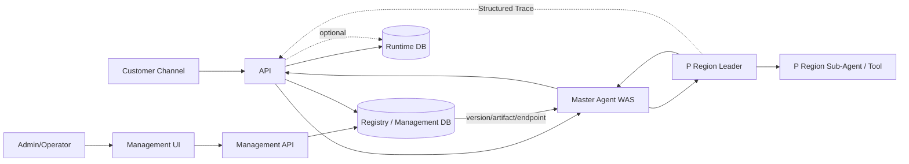
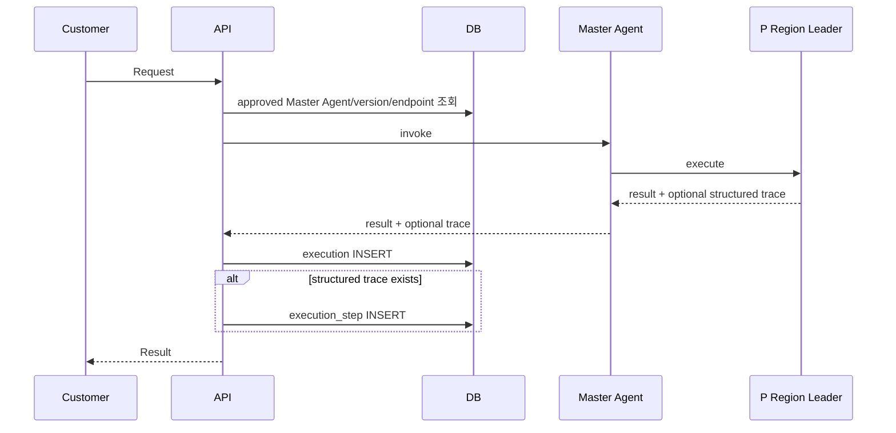

# ARCHITECTURE — K Region AI Agent Orchestrator (ERD v1.2 Baseline)

## 1. 아키텍처 원칙

1. ERD v1.2를 데이터·상태·관계의 최우선 기준으로 한다.
2. UI/API/MASTER_AGENT 세 Source Group으로 Registry를 통일한다.
3. Master Agent는 Registry Version과 Runtime Artifact Version으로 관리한다.
4. Master Agent 실제 WAS 주소는 `master_agent_endpoint`에서 분리 관리한다.
5. 고객 요청 시작 시 execution을 만들지 않는다.
6. Master Agent가 P Region Leader를 실행하고 결과를 받은 뒤 execution을 저장한다.
7. execution_step은 P Region Structured Trace가 있을 때만 저장한다.
8. Worker/Queue/Lease/Heartbeat 기반 실행 제어 Plane을 두지 않는다.
9. Policy/Rule/Governance Plane을 두지 않는다.
10. P Region 내부 Sub-Agent/Tool orchestration은 P Region 책임으로 둔다.

## 2. 전체 구조



## 3. 영역별 책임

### 3.1 Management 영역

- Registry Component/Version 관리
- Source Group 관리
- Runtime Artifact Version 관리
- Master Agent Endpoint 관리
- P Region/Leader 관련 등록·승인 정보 관리(ERD v1.2 범위)
- 배포/운영 관리
- 감사/조회

### 3.2 Runtime API 영역

- 고객 인증/입력 검증
- Master Agent 대상 결정에 필요한 승인 정보 조회
- Master Agent 호출
- 결과 수신
- execution 저장
- optional execution_step 저장
- 고객 응답

### 3.3 Master Agent 영역

- K Region이 승인한 Runtime Version으로 실행
- 승인된 P Region Leader 선택/호출
- P Region 결과 수신
- 결과를 API에 반환
- P Region 내부 Sub-Agent/Tool을 직접 관리하지 않음

### 3.4 P Region 영역

- Leader Runtime 실행
- 내부 Sub-Agent/Tool Routing
- 업무 실행
- 결과 반환
- 가능한 경우 Structured Trace 반환

## 4. Registry Architecture

```text
Source Group
  ├─ UI
  ├─ API
  └─ MASTER_AGENT

registry_component
  └─ registry_version
      └─ runtime_artifact_version
```

Master Agent 추가 관계:

```text
Master Agent registry/version
  + runtime_artifact_version
  + master_agent_endpoint
```

Artifact와 Endpoint는 역할이 다르므로 하나로 합치지 않는다.

## 5. 고객 요청 실행 시퀀스



중요: 첫 DB 동작이 반드시 아무 기록도 하지 않는다는 의미가 아니라, **execution을 사전 생성하지 않는다는 의미**다. 요청 추적을 위한 기존 ERD v1.2 구조가 있다면 그대로 사용할 수 있으나 신규 테이블은 만들지 않는다.

## 6. 장애 경계

### 6.1 API/Master Agent Process 장애

- Kubernetes/WAS HA
- Readiness/Liveness
- 다중 Replica 또는 LB

### 6.2 Master Agent → P Region 장애

- Timeout
- Circuit Breaker
- 제한적 Retry
- 실행 여부 불명 시 Status Query Contract 우선

### 6.3 P Region 성공 후 DB 저장 장애

P Region 실행과 DB 저장을 하나의 분산 Transaction으로 가정하지 않는다.

```text
P Region 성공
→ 결과 수신
→ DB 저장 실패
```

이 경우 DB 저장 오류 때문에 P Region을 자동 재실행하지 않는 것이 기본 원칙이다.

## 7. 배포 아키텍처

- UI/API/Master Agent는 Source Group 및 Registry Version과 연결해 배포 대상을 식별한다.
- Runtime Artifact의 실제 배포 증적은 `runtime_artifact_version` 기준을 사용한다.
- Master Agent WAS 주소 변경은 `master_agent_endpoint` 관리 규칙을 따른다.
- 구버전 v1.5 Canary 전용 데이터 모델을 ERD v1.2에 자동 이식하지 않는다.
- OCP/Kubernetes의 Replica, PDB, Topology, Probe 등 인프라 HA는 데이터 모델과 독립적으로 적용 가능하다.

## 8. 아키텍처 금지사항

- Runtime API가 execution을 QUEUED 상태로 먼저 저장
- execution-worker 도입
- DB Queue/Claim
- Lease/Heartbeat Recovery
- Master Agent가 P Region Sub-Agent를 직접 선택
- K Region이 P Region Trace 없이 execution_step 생성
- Policy/Rule/Governance 별도 Plane
- Endpoint를 Runtime Artifact Version에 임의 컬럼으로 흡수
- ERD v1.2 승인 없이 상태 머신 확장
